

Mana robotica care joaca dame

de Ion Radu

# Cuprins
[Contextul	3](#_toc206957858)

[Elemente folosite	4](#_toc206957859)

[Arhitectura programului	5](#_toc206957860)

[Resurse	12](#_toc206957861)

## Contextul
##
Acest proiect a fost realizat in ACE, aplicatie pentru programarea robotilor OMRON si in python pentru realizarea serverului TCP.

Pentru tabla de dame s-a folosit standardul international de 10x10, cu 40 de piese in total. 

Exista 2 moduri de joc: AI vs AI si Player vs AI. 

## Elemente folosite

*Figure *1* Elemente Folosite*

Aceasta aplicatie foloseste o mana robotica tip Viper 850. Tabla de joc a fost proiectata in fusion, iar piesele de joc sunt reprezentate cu obiectul ICylinder, resursa oferita de programul Ace. 

## Arhitectura programului
Exista un script in python, care creeaza un server tcp la care se conecteaza robotul si de la care preia informatiile aferente miscarii pieselor. Scriptul python foloseste o librarie numita “pydraughts” cu ajutorul careia creeaza o tabla virtuala de joc, care la randul ei folosete motorul de miscare “kr\_hub.exe” pentru generarea miscarilor.

Serverul primeste un string de forma: “42x48,[5,2],2,[2, 4],0”; si robotul truncheaza acest sir de text preluand informatiile necesare cum ar fi: coordonatele miscarii (pozitia initiala: 42 la pozitia finala 48), se captureaza sau nu piese in aceasta tura (liniuta ‘–‘ inseamna ca nu se captureaza, iar ‘x’ inseamna ca se captureaza), piesele capturate, randul culorii curente, regii de pe table si daca a fost promovata vreo piesa in tura curenta.

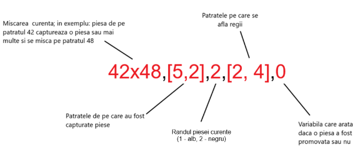

*Figure *2* Formatul textului primit de robot*

Aceasta operatie de trunchiere se face cu ajutorul functiei POS() si MID().

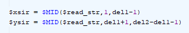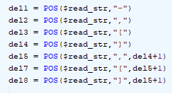

*Figure 2.a Folosirea functiei POS*

\1) Coordonatele

In cazul miscarii piesei in pozitia ei finala se face urmatorul calcul:

pick = SHIFT(p1 BY dist \* (INT((x – 1) / 5 ) MOD 2) - ((x – 1) MOD 5) \* 2 \* dist,  INT((x - 1) / 5) \* dist, height\_mod)

place = SHIFT(p1 BY dist \* (INT((y - 1) / 5) MOD 2) - ((y - 1) MOD 5) \* 2 \* dist, INT((y - 1) / 5) \* dist, height\_mod)

dist – distanta dintre piese

height\_mod – inaltimea piesei care trebuie mutata
poze/
p1 – coordonatele primului patrat negru

x – numarul patratului initial

y- numarul patratului final

Exemplu:  31 – 27

Sa presupunem ca vrem sa miscam piesa alba de pe patratul 31(x) pe patratul 27(y), ca in figura de mai jos:

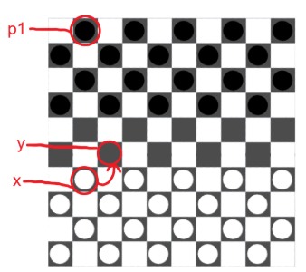

*Figure *4* Exemplu mutare*

Ca sa putem stabili pozitia unei piese pe tabla de joc ne folosim de urmatoarea legenda:

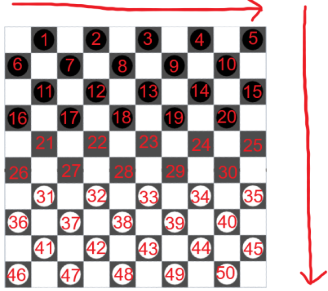

*Figure *5* Legenda coordonatelor*

P1 este definit ca fiind primul patrat negru din tabla de joc, iar in exemplul nostru acesta are urmatoarele coordonate:\
X: 660.000, Y: -200.000, Z: 0.000

Variabilele dist si height\_mod vor fi 40, respectiv 15, iar calculul pozitiilor ’pick’ si ’place’ va decurge in felul urmator:

pick = SHIFT(p1 BY 40 \* (INT((31 – 1) / 5 ) MOD 2) - ((31 – 1) MOD 5) \* 2 \* 40,  INT((31 - 1) / 5) \* 40, 15)

pick = SHIFT(p1 BY 40 \* (INT(30 / 5 ) MOD 2) - (30 MOD 5) \* 80,  INT(30 / 5) \* 40, 15)

pick = SHIFT(p1 BY 40 \* (6 MOD 2) - 0 \* 80,  6 \* 40, 15)

pick = SHIFT(p1 BY 40 \*0 - 0,  240, 15)

pick = SHIFT(p1 BY 0,  240, 15)

pick = X: 660.000 + 0, Y: -200.000 + 240, Z: 0.000 + 15

pick = X: 660.000, Y: 40.000, Z: 15.000

place = SHIFT(p1 BY 40 \* (INT((27 – 1) / 5 ) MOD 2) - ((27 – 1) MOD 5) \* 2 \* 40,  INT((27 - 1) / 5) \* 40, 15)

place = SHIFT(p1 BY 40 \* (INT(26/ 5 ) MOD 2) - (26 MOD 5) \* 80,  INT(26 / 5) \* 40, 15)

place = SHIFT(p1 BY 40 \* (5 MOD 2) - 1 \* 80,  5 \* 40, 15)

place = SHIFT(p1 BY 40 \* 1 - 80,  200, 15)

place = SHIFT(p1 BY -40,  200, 15)

place = X: 660.000 - 40, Y: -200.000 + 200, Z: 0.000 + 15

place = X: 620.000, Y: 0.000, Z: 15.000

pick    = X: 660.000, Y: 40.000, Z: 15.000

place = X: 620.000, Y: 0.000, Z: 15.000

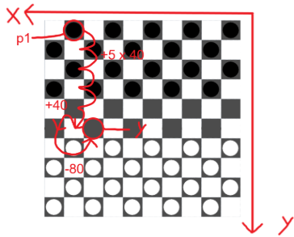

poze/

Formula incrementeaza x-ul intr-o maniera ciclica, mutand pozitia initiala cu cate 2 patrate spre dreapta pana ajunge in capat moment in care revine in pozitia initiala, iar la fiecare rand impar, x-ul se muta un patrat la stanga, deoarece pozitia patratelor negre alterneaza cu fiecare rand, iar y-ul este incrementat din 5 in 5 patrate.

\2) Capturarea

In cazul in care o miscare este reprezentate in felul acesta: 27x16; atunci inseamna ca niste piese vor fi capturate. Robotul primeste un array in forma text: ”[21, 11, 12, ...]”, care contine cel putin un element in cazul unei capturari.

Programul robotului foloseste o bucla WHILE ca sa citeasca fiecare element din array si folosindu-se de formula de recunoastere a pozitiei, ridica piesa si o pune intr-o stiva de piese capturate amplasata in 4 coloane a cate 5 piese, ordonate intr-un patrat 2x2.

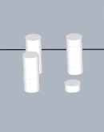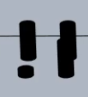

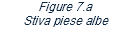

	

In bucla WHILE ne folosim de functiile POS si WHILE ca sa extragem valoarea patratului pe care se afla piesa si o memoram intr-o variabila.

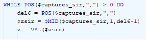

*Figure *8* Bucla WHILE pentru array piese capturate*

\3) Randul culorii curente

Randul jucatorului curent este exprimata printr-un numar: 1 pentru alb si 2 pentru negru.

Cu ajutorul acestei variabile putem determina in tabara cui va ajunge piesa capturata.

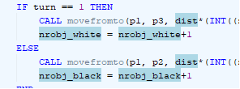

*Figure *9* Structura IF care determina locatia aferenta culorii*poze/

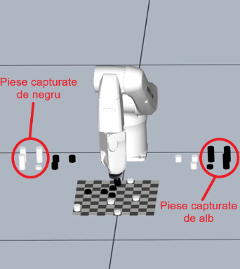

*Figure *10* Locatia pieselor capturate*

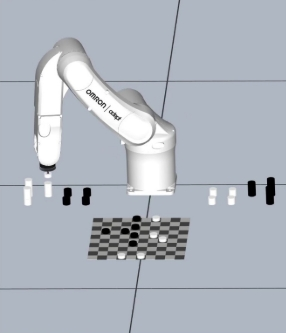

\4) Locatia regilor

Acest array este verificat de fiecare data inainte de executarea unei miscari sau inaintea capturarii unei piese, deoarece regele este de 2 ori mai inalta decat o piesa normala si este esential sa nu intre in coliziune cu aceasta. Prin intermediul unui for se verifica pozitia regiilor si daca corespunde cu miscarea curenta, modifica o variabila globala, numita is\_king, din FALSE in TRUE si modifica variabila height\_mod din 15 in 30.

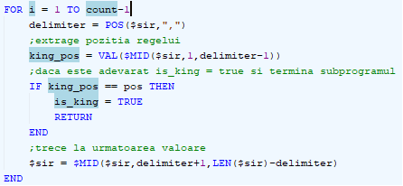

*Figure *12* Bucla FOR*

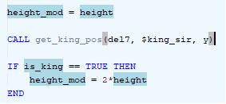

*Figure *13* Daca este rege modifica height\_mod*

\5) Promovarea

Atunci cand piesa ajunge in cealalta parte a tablei de joc aceasta este promovata in rege. Scriptul python verifica daca numarul de regi a fost incrementat si daca este adevarat, serverul ii trimite robotului numarul ’1’, semn ca o piesa a fost promovata. In cazul in care nu se schimba numarul de regi valoarea ramane ’0’.

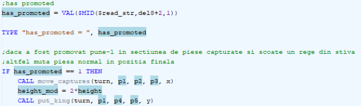

*Figure *14* Promovarea*

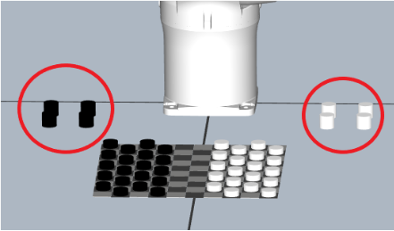

*Figure *15* Stiva de regi*
## Resurse
1. ` `<https://github.com/AttackingOrDefending/pydraughts>
1. <https://edgilbert.org/InternationalDraughts/download_links.htm>
1. <https://docs.python.org/3/howto/sockets.html>
1. <https://realpython.com/python-sockets/>
1. documentatia din aplicatia ace 
1. cursurile din scoala de vara

12

